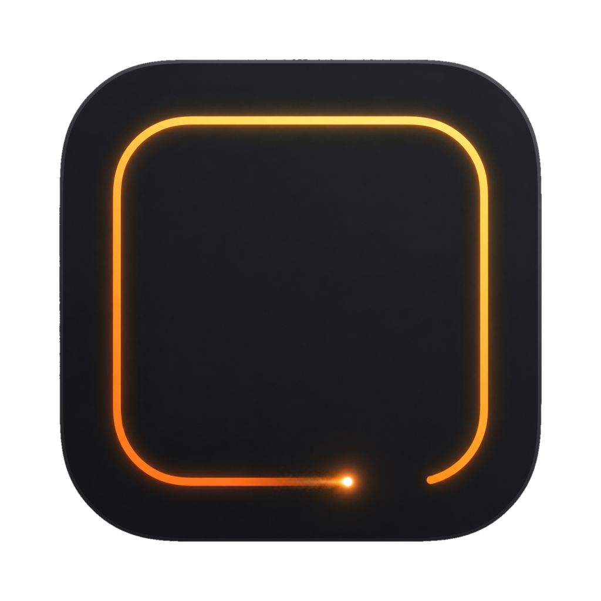

# Wick

<p align="center">
  
</p>

A timer that burns down the edge of your screen.

Wick draws a thin line around the perimeter of your display and shortens it as
your time runs out. No window to keep visible, no number to keep checking —
you see how much is left out of the corner of your eye, and a sound tells you
when it's done. Set it from the menu bar and get back to work.

## Install

```bash
./install.sh
```

Builds, copies to `/Applications`, registers the `wick://` URL scheme and
launches it. Wick lives in the menu bar — there's no dock icon.

For a local build without installing, `./build.sh` drops `build/Wick.app`.

## Using it

Click the menu bar timer and pick a length (5 – 60 min, or **Custom…** which
accepts `25`, `45m`, `1h30`, `90s`). While it runs you can **Pause**, **Stop** or
**Add 5 min**. When it ends the border pulses red and the chime plays until you
dismiss it — or for two minutes, whichever comes first.

## Styles

Ten borders, switchable from **Style** in the menu and previewed live in
Settings. Seven are meant for working; three are not.

**Calm**

| Style | What it looks like |
| --- | --- |
| **Plain** | A grey line that shortens. No motion at all — the default. |
| **Fade** | The same line, dissolving at the leading edge instead of ending in a cap. |
| **Pulse** | A blue line with a breathing head and a short afterglow behind it. |
| **Split** | Burns both ways from the top and meets at the bottom, so what's left reads as a shape. |
| **Minutes** | One tick per minute. The current minute dims, then its tick goes out. Countable at a glance. |
| **Tide** | A slow bright wave travelling along what's left. Never still, never distracting. |
| **Level** | Drains like liquid down the sides, with a wobbling surface and a bright meniscus. |

**Playful**

| Style | What it looks like |
| --- | --- |
| **Fuse** | A pale twisted hemp cord burning down, sparkler head, falling sparks. |
| **Snake** | Snake, played properly: the body grows behind the head, apples wait ahead, the screen is full when time's up. |
| **Aurora** | Drifting colour that washes out to grey as the timer runs down. |

The calm styles warm to amber over the last 15% and to red over the last 5%, so
the end of a timer is visible without watching for it.

**Width** is `1`, `3`, `6` or `10` px from the menu, or anything from 1–24 px in
Settings. The 1 px hairline is about as quiet as a timer gets and still reads at
the edge of your vision. On a MacBook the corners are rounded to match the display's own glass;
on an external monitor they stay square. Both are automatic, and overridable.

## Focus and distractions

- **Focus** — macOS doesn't let an app switch a Focus mode directly, so Wick runs
  two Shortcuts you create once: `Wick Focus On` and `Wick Focus Off` (each one
  a single **Set Focus** action). Settings tells you when it can see them.
- **Distraction nudge** — say which apps are **allowed** and everything else is
  hidden while the timer runs, or flip it round and list only the ones to hide.
  Reach for a hidden app mid-timer and it goes straight back down. Whatever you
  were working in when you hit start counts as allowed, Finder is never hidden,
  and an empty list does nothing. It's a nudge, not a lock — hard blocking needs
  a system extension.

**Global shortcuts** are off until you turn them on in **Settings → General**,
where you record whatever combination you like — one for start/pause/resume, one
for stop. They work anywhere and need no Accessibility permission. If a
combination does nothing, another app already owns it.

**A notification** fires when the timer ends, for when you've walked away from
the screen; the permission is asked for the first time you start a timer, not at
launch.

A running timer survives a quit or a restart — Wick picks it back up with the
right amount of time left. **Reduce Motion** in System Settings forces the still
style, whichever one is selected.

## Scripting

Wick answers a URL scheme, so it drops into Raycast, Shortcuts, or a shell alias:

```bash
open "wick://start?d=25m"
open "wick://toggle"      # pause or resume
open "wick://add?d=10m"
open "wick://stop"
```

`open -a Wick --args --start 25m` launches straight into a timer, and
`open "wick://settings"` opens Settings.

When working on a style, `open "wick://start?d=25m&at=0.42"` starts a timer
already 42% spent, so you can see the interesting part without waiting for it.

A **Raycast extension** lives in [`raycast/`](raycast/) — Start Timer (with a
duration argument), Pause or Resume, Add Time, Stop:

```bash
cd raycast && npm install && npx ray develop
```

A **Claude Code skill** at `~/.claude/skills/focus-timer/` lets Claude set one
for you: "give me 25 minutes on this" starts the border and reports the time.

## How it draws

The overlay is one borderless click-through window per screen, above full-screen
apps and the menu bar. The border is a rounded rectangle parametrised by arc
length, so the head travels at a constant speed no matter which edge it's on.

Two constraints shape the look. The window is transparent over whatever you're
working in, so nothing can assume a backdrop: every lit line gets a thin dark
keyline under it to hold an edge on a white document and a dark editor alike, and
glows stay small and saturated, because a wide faint glow is just a smudge on
white. And a 25 minute timer shouldn't repaint a 5K screen sixty times a second,
so each frame marks only the region that actually changed — the head, its glow,
and the sparks in flight.

## Building

```bash
./build.sh          # build/Wick.app, ad-hoc signed
./install.sh        # build, install to /Applications, register wick://
./sign-install.sh   # the same, Developer ID signed
./test.sh           # unit tests
```

Tests cover the two pieces worth pinning down — duration parsing and the ring's
arc-length geometry — as a plain executable rather than XCTest, since the app is
built with `swiftc` and has no scheme. CI runs them on every push and publishes a
signed, notarised `Wick.zip` when the Apple secrets are set.

## Requirements

macOS 14 or later, Apple silicon.
